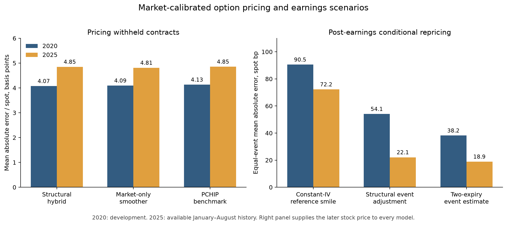

# Event-aware equity-option pricing

A pricing engine that combines a diffusion/earnings-jump model with a smooth market-calibrated option curve. It prices contracts outside the calibration sample, represents overnight and weekend variance separately, and studies how option prices change when earnings passes.

**The final result is a market-pricing tool, not a demonstrated trading edge.** On 23,650 withheld contracts from January–August 2025, the structural hybrid's mean absolute error was **$0.228 per option share**, its median error was **$0.062**, and **87.0%** of prices fell inside the quoted bid–ask interval. The simpler market-only mode reached **89.7%**. These results condition on other reference quotes from the same snapshot; they do not predict prices without market inputs.



## What the engine provides

- **Structural pricing:** Gaussian-mixture scheduled earnings jumps, with either flat diffusion or Heston stochastic volatility. Closed-form and COS methods price individual European calls and puts.
- **Market-calibrated pricing:** A constrained cubic call-price curve built from reference quotes. Use a market-IV prior or add the structural model's smile with a reference-residual correction. Both modes enforce decreasing, convex call prices within an expiry and use consistent put–call parity.
- **Time handling:** Calendar time for carry/discounting and optional weighted variance time for sessions, overnights, weekends and holidays. Multiple independent scheduled jumps combine without enumerating an exponential tree.
- **Event scenarios:** Estimate the earnings component and remove it when the event passes. This improves post-event conditional repricing relative to keeping pre-event IV unchanged, although simpler event estimates remain competitive or better.

## Historical pricing results

Errors are prices per underlying share. “Spot bp” means absolute error divided by the stock price, multiplied by 10,000. The target strike and its call/put twin are excluded from calibration; reference sets contain up to eight quotes per expiry and five expiries.

| Pricing method | 2020 MAE, spot bp | 2020 inside bid–ask | 2025 MAE, spot bp | 2025 inside bid–ask |
|---|---:|---:|---:|---:|
| Structural hybrid, constrained | 4.074 | 95.5% | 4.849 | 87.0% |
| Market-only, constrained | 4.095 | 96.5% | 4.811 | 89.7% |
| PCHIP IV benchmark | 4.131 | 96.3% | 4.855 | 88.9% |
| Linear IV benchmark | 4.357 | 93.3% | 4.856 | 85.0% |
| SSVI slice benchmark | 4.841 | 88.3% | 5.676 | 73.5% |

2020 is the development sample: 118,117 quotes on 1,068 snapshots across six names. The later historical sample has 23,650 quotes on 251 eligible snapshots across five names; the available database ends on August 29, 2025. The hybrid does **not** consistently beat simple interpolation. Its purpose is to retain structural event scenarios while anchoring current prices to observed markets.

The full [project report](docs/PROJECT.md) covers pricing, event repricing, hedging, strategy outcomes and limitations. Aggregate numbers are in [final_metrics.json](docs/final_metrics.json).

## Run an offline example

```sh
python -m pip install -r requirements-core.txt
python demo_market_surface.py
python demo_clock.py
```

Use Python 3.10 or newer. The first demo creates eight synthetic reference quotes and prices five withheld strikes. It requires no credentials, live prices or licensed data.

```python
from market_surface import MarketSlice

# One reference quote per distinct strike, all for the same expiry.
curve = MarketSlice.fit(
    spot=100.0, maturity=30 / 365,
    strikes=[90, 95, 105, 110],
    midpoints=[0.16, 0.89, 1.02, 0.23],
    is_call=[False, False, True, True],
    half_spreads=[0.02, 0.02, 0.02, 0.02],
    rate=0.03,
)
call_price = curve.price(100.0)
put_price = curve.price(100.0, call=False)
```

Supply `structural_call_price`, a function accepting strikes and returning structural call prices for the same expiry and carry, to enable the hybrid. [demo_market_surface.py](demo_market_surface.py) shows the full Heston/jump integration. A standard 100-share contract costs 100 times the returned per-share price.

## What the trading work found

Individual-option convergence, earnings calendars, weekend calendars, butterflies and pre/post-earnings trades produced no established after-cost edge. The original single-option losses were concentrated on shorts. Weekend calendars had a small positive midpoint result, largely from the stock hedge, which disappeared after quoted costs. Better pricing did not automatically produce better trading signals.

Event-matched hedges strongly outperformed delta–vega hedges, but ordinary delta–gamma hedging explained most of that gain. A separate 2025 comparison did not establish an additional benefit from the structural event model.

## Scope and remaining extensions

These are European prices applied to a selected non-dividend equity sample; American exercise, dividends, and corporate actions require additional handling. Strike constraints do not guarantee a complete surface free of calendar arbitrage. Event-date histories are retrospective. Daily bid/ask scenarios do not establish passive fills, queue position or market-making profitability.

Scheduled jumps, variance clocks, Heston, SSVI, empirical delta hedging and constrained interpolation have prior literature. This project does not claim a new mathematical pricing method; see the [prior-art map](research2/PRIOR_ART.md). Useful extensions include joint maturity constraints, American-option pricing, and intraday execution data. The October 2026–March 2027 prospective paper-test window remains reserved; no future results are claimed.

## Code map

| Component | Entry point |
|---|---|
| Fitted market curve | [market_surface.py](market_surface.py) |
| Gaussian-mixture jump pricing | [earnings_mixture.py](earnings_mixture.py) |
| Heston/COS pricing | [cos_pricer.py](cos_pricer.py) |
| Overnight/weekend clocks | [CLOCK_MODEL.md](CLOCK_MODEL.md), [clocked_pricer.py](clocked_pricer.py) |
| Strategy implementations | [strategy_lab/README.md](strategy_lab/README.md) |
| Pricing/hedging/transport experiments | [research2/README.md](research2/README.md) |
| Original derivations and prototypes | [docs/methods.tex](docs/methods.tex), [archived notes](docs/PROTOTYPE_NOTES.md) |

Licensed quote histories and individual-trade outputs live outside this repository. The demos are synthetic; the public figure and tables are aggregate research results.
