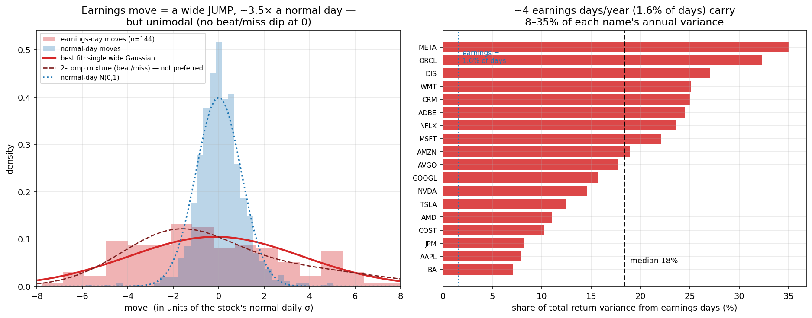
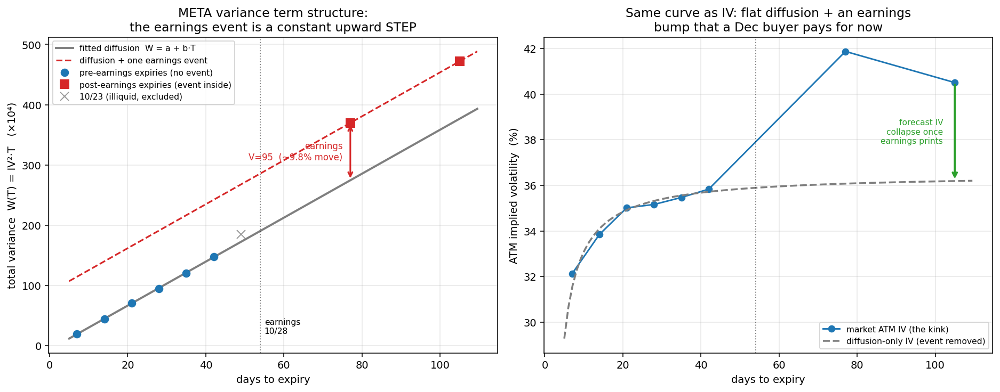

# Archived prototype notes

This is the earlier prototype description, preserved for context. The current project and empirical conclusions are in [README](../README.md) and [PROJECT](PROJECT.md). Small prototype fits and older scope statements below are superseded by those documents.

# earnings-vol-model

Pricing equity options with a **scheduled earnings jump** instead of one flat
volatility, and then checking the jump against what stocks actually do on earnings
days.

The short version: earnings is a real, large jump (earnings days are ~1.6% of
trading days but a **median 18% of a stock's annual variance**), but it is **not
bimodal** — a single wide jump fits realized moves better than a beat/miss
mixture. So the model separates event risk from ordinary diffusion, but the
"beat/miss" shape it started from isn't supported by the data.



## What it does

- Prices European options as diffusion + a jump that only applies to expiries
  containing the earnings date. The jump is a Gaussian mixture, and the price is a
  closed-form weighted sum of Black-76 prices (no simulation).
- Optionally swaps the flat diffusion for Heston stochastic vol (for skew) and
  prices the combination by the Fourier-cosine (COS) method — a Bates-style model
  with a scheduled jump.
- Decomposes the ATM implied-vol term structure into a diffusion line plus an
  earnings step, and pulls the implied earnings move out of live chains.
- Tests the jump against realized earnings moves (18 names, last 8 earnings each).

Math and derivations are in [`docs/methods.tex`](prototype_methods.tex).

The optional [overnight/weekend variance clock](../CLOCK_MODEL.md) adds exact
timestamps, separate session/closure variance weights, and multiple independent
scheduled jumps without expanding an exponential mixture tree. These inputs
require calibration; existing examples still use their original calendar clock.
Run `python demo_clock.py` for an explicitly uncalibrated illustration.

The [strategy lab](../strategy_lab/README.md) implements seven research strategies,
reference-versus-held-strike pricing tests, delayed convergence exits, and
explicit transaction-cost and missing-exit accounting. It runs only within the
designated calibration period; separate overnight/daytime trading requires
opening option quotes that the daily dataset does not supply.

## Results

Prototype fits, mostly in-sample. Better fit with more parameters is not evidence
of an edge.

| Experiment | RMSE (vol pts) | Scope |
|---|---|---|
| META ATM curve | flat 3.78 / event-strip 0.25 | one expiry excluded |
| META Dec options | 0.36 | 11 strikes, no per-strike fit |
| META joint (Bates) | 0.58 | 6 params, 20 targets, in-sample |
| ORCL Sep-11 smile | flat+jump 2.37 / full 1.08 | 2 vs 5 params, in-sample |
| 9-stock smiles | flat 0.58 / Heston 0.08 | mean per-stock, 5 strikes |

Two things worth calling out:

- **Forward volatility** is ~36% between every pair of expiries except the one
  straddling earnings, where it jumps to 48% — a clean sign that one flat vol
  can't hold (`figures/bs_vs_events.png`).
- **Realized moves aren't bimodal.** Across 144 events a single wide Gaussian beats
  a 2- or 3-component mixture by BIC, so the honest default is a fat single jump;
  the mixture is only useful as a flexible fitter for the implied smile.



## Run

```bash
pip install -r requirements.txt
python demo_price.py            # closed form vs Monte Carlo
python fetch_earnings_data.py   # pull prices + earnings dates (yfinance)
python earnings_study.py        # the realized-move study
```

## Layout

- `earnings_mixture.py` — closed-form mixture-of-Black-76 pricer, MC check, IV inversion
- `cos_pricer.py` — COS Heston-plus-jump (Bates) pricer
- `real_orcl.py`, `orcl_heston.py` — single-expiry smile, mispricing scan, flat vs Bates refit
- `meta_term_structure.py`, `bates_term_structure.py` — event decomposition, surface fit
- `meta_smile.py`, `demo_bs_vs_events.py`, `multistock_confirm.py` — per-strike repricing, forward-vol tests, cross-name skew
- `fetch_earnings_data.py`, `earnings_study.py` — the empirical study
- `docs/methods.tex` — the write-up; `figures/` — result plots

## Scope

Not a trading claim — the market already prices earnings and skew. The point is to
decompose implied vol into diffusion / skew / event, forecast things one flat vol
can't (like the post-earnings IV drop), and test the jump against realized data.
Marks are dated 2026-09-04. A proper implied-vs-realized premium study needs
option history and is left for later.
